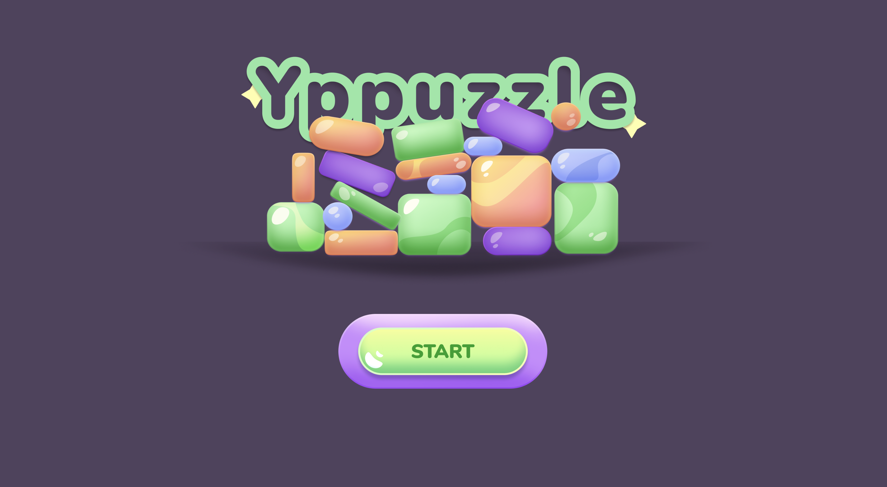
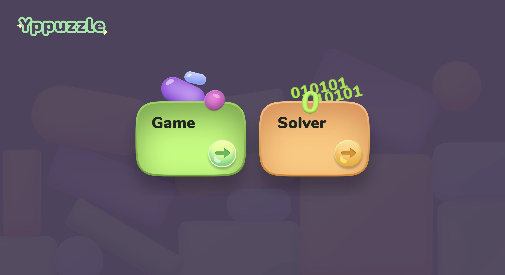
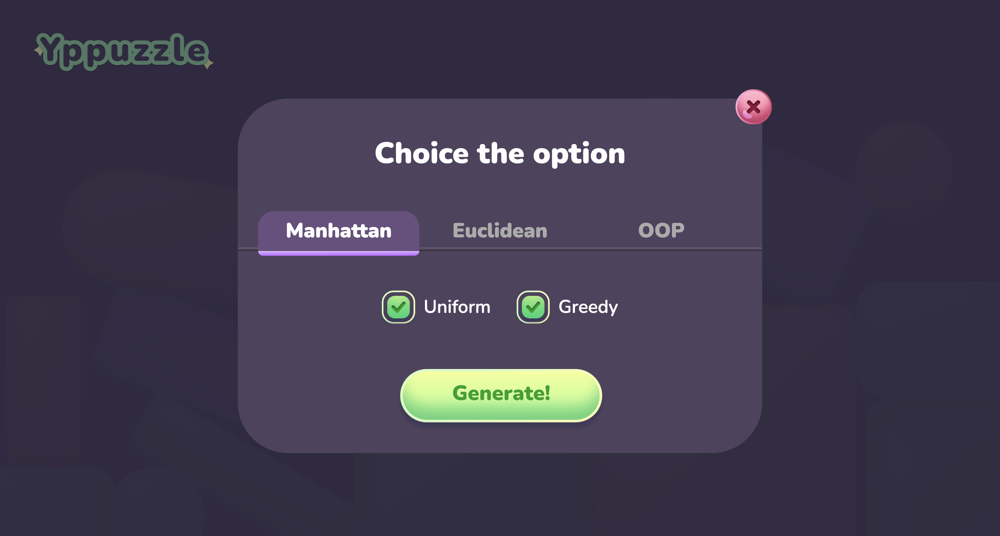
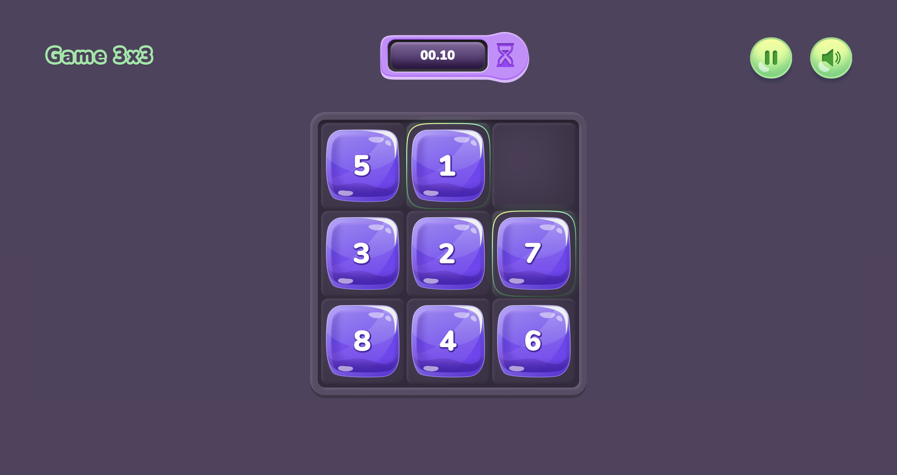
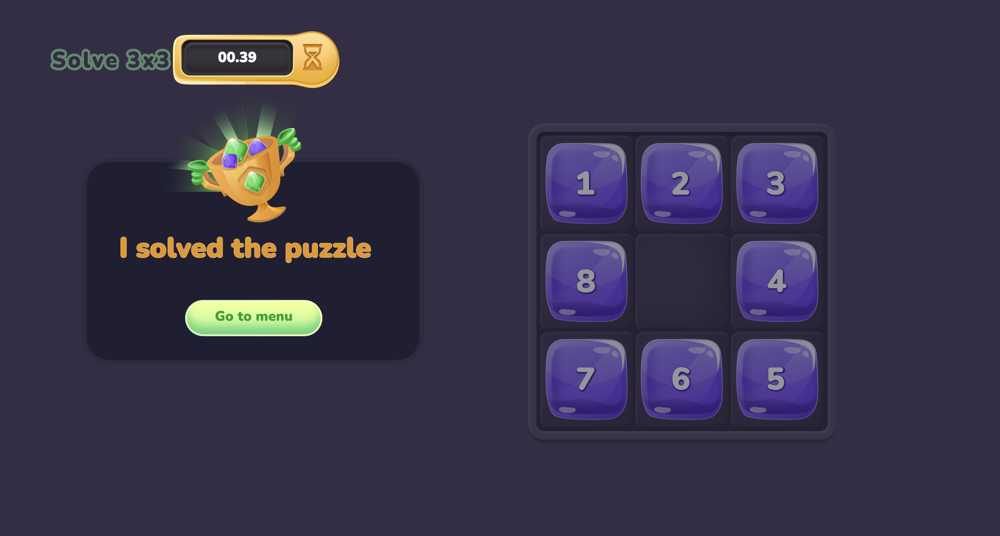

# Npuzzle Game and Solver

This project is primarily about the A* algorithm and the priority queue data structure with which the Npuzzle solver is implemented. Secondly, the project is an independent game implemented in React.


## Technologies

1. Js
2. Html
3. Css (styled-components)
4. React
5. React Router
6. Node Js
7. Express
8. Typescript
9. Docker
10. Docker compose
11. Webpack


## Launch

1. In the main project directory, run the Make utility

   ```sh
   $ make re
   ```

2. After building, go to the following address in your browser:

   ```sh
   $ localhost:3001
   ```

3. Play and enjoy


## Desktop
  
  
  
  
  


  
